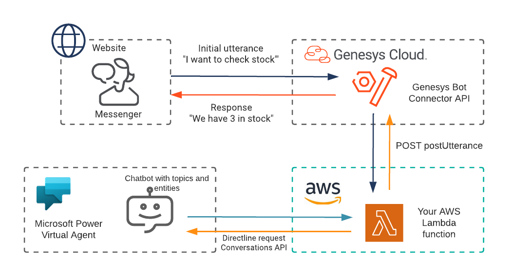

# bot-connector-for-ms-power-virtual-agent

This Genesys Cloud Developer Blueprint explains how to deploy a Microsoft Power Virtual Agent (VA) bot to answer your customer queries through web messaging and Messenger. The blueprint also provides the solution for using a third-party bot that Genesys Cloud does not support as a strategic vendor. The solution uses the Genesys Bot Connector that provides the API and acts as the link between Genesys Cloud and the bot. In this solution, the bot interpreter application created using AWS Lambda functions acts in between Genesys Cloud and Microsoft Power VA. The application receives the utterances from the Messenger through Genesys Bot Connector. It changes the format of the request before sending out an HTTP request to Microsoft Power VA for Natural Language Understanding (NLU). It also converts the response message received from Microsoft Power VA to match the postUtterance API that is provided by the Genesys Bot Connector.

