---

title: Use Web Messaging with Genesys Bot Connector and Microsoft Power VA (Virtual Agent)
author: Marc Sassoon and Pierrick Lozach
indextype: blueprint
icon: blueprint
image: 
category: 3
summary: |
  his Genesys Cloud Developer Blueprint explains how to deploy a Microsoft Power Virtual Agent (VA) bot to answer your customer queries through Web Messaging. The blueprint also provides the solution for using a third-party bot that Genesys Cloud does not support as a strategic vendor. The solution uses the Genesys Bot Connector that provides the API and acts as the link between Genesys Cloud and the bot.
---

This Genesys Cloud Developer Blueprint explains how to deploy a Microsoft Power Virtual Agent (VA) bot to answer your customer queries through Web Messaging. The blueprint also provides the solution for using a third-party bot that Genesys Cloud does not support as a strategic vendor. The solution uses the Genesys Bot Connector that provides the API and acts as the link between Genesys Cloud and the bot.

## Scenario

 Genesys Cloud supports and provides the interface for selected chatbot providers such as AWS and Google. Many new chatbot vendors are fast-growing in the market. A customer wants to bring in their preferred third-party bots in the Architect message flows and populate the bot list.

## Solution

Genesys Bot Connector provides the API to call third-party bots in an Architect message flow. The blueprint showcases how to connect to the Microsoft Power VA bot to answer customer queries through Messenger from Genesys Cloud using the AWS services:

1. Create an application using AWS Lambda functions. The bot interpreter application acts in between Genesys Cloud and Microsoft Power VA. 
2. In Microsoft Power VA, create a chatbot with topics and entities.
3. In your website, configure a Messenger.

The application receives the utterances from the Messenger through Genesys Bot Connector. It changes the format of the request before sending out an HTTP request to Microsoft Power VA for Natural Language Understanding (NLU). It also converts the response message received from Microsoft Power VA to match the postUtterance API that is provided by the Genesys Bot Connector.

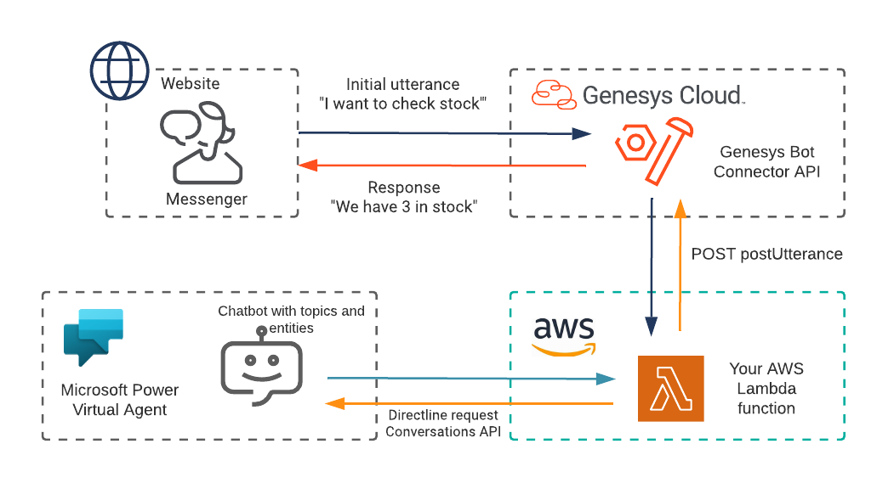

## Contents
* [Solution components](#solution_components "Goes to the Solutions components section")
* [Prerequisites](#prerequisites "Goes to the Prerequisites section")
* [Implementation steps](#implementation_steps "Goes to the Implementation steps section")
* [Additional resources](#additional_resources "Goes to the Additional resources section")

## Solution components

* **Genesys Bot Connector** - The Genesys Bot Connector configuration allows your third-party bots to interact conversationally with customers. In this solution, a set of RESTful APIs allows you to connect to any bot platform to send and receive utterances.
*  **Architect flow** - A flow in Architect, a drag and drop web-based design tool, dictates how Genesys Cloud handles inbound or outbound interactions.
* **Microsoft Azure account** - A cloud computing platform that provides a variety of cloud services for building, testing, deploying, and managing applications through Microsoft-managed data centers. Microsoft Azure hosts the Power VA bot.
* **AWS** - Amazon Web Services, a cloud computing platform that provides a variety of cloud services such as computing power, database storage, and content delivery. AWS hosts Genesys Cloud.
* **AWS Lambda** - A serverless computing service for running code without creating or maintaining the underlying infrastructure. In this solution, the Lambda function acts as the bot interpreter application that is written in Python.
* **Amazon API Gateway** - An AWS service for using APIs in a secure and scalable environment. In this solution, the API Gateway exposes a REST endpoint that is protected by an API key. Requests that come to the API Gateway are forwarded to an AWS Lambda.
* **REST API client** - A method or tool, such as Postman or YARC, that invoke REST API services. In this solution, you send an HTTP PUT request with JSON payload to the Bot Connector API that creates the bot list.
* **Website with Messenger** - A website with a message window to interact with the bot. It is required to test the solution.
  

## Prerequisites

### Specialized knowledge

* Administrator-level knowledge of Genesys Cloud
* Experience using the Genesys Cloud Platform API
* Experience using Microsoft Power VA
* Experience designing Architect flows
* Knowledge about adding scripts to HTML pages

### Genesys Cloud account

* A Genesys Cloud license. For more information, see [Genesys Cloud pricing](https://www.genesys.com/pricing "Opens the Genesys Cloud pricing page") on the Genesys website.
* The Master Admin role in Genesys Cloud. For more information, see [Roles and permissions overview](https://help.mypurecloud.com/?p=24360 "Opens the Roles and permissions overview article") in the Genesys Cloud Resource Center.

### AWS account

* An administrator account with permissions to access the following services:
	* AWS API Gateway
	* AWS Lambda

### Microsoft Azure account
* An administrator account with permissions to create a bot in Microsoft Power VA.

## Implementation steps

* [Clone the GitHub repository](#clone-the-github-repository "Goes to the Clone the GitHub repository section")
* [Create a Microsoft Power VA bot](#create_a_power_va_bot "Goes to the Create a Power VA bot section")
* [Configure AWS services](#configure_aws "Goes to the Configure AWS services section")
* [Configure Genesys Cloud](#configure_genesys_cloud "Goes to the Configure Genesys Cloud section")
* [Load the Microsoft Power VA bot to the Genesys Cloud bot list](#load-the-power-va-bot-to-the-genesys-cloud-bot-list "Goes to the Load the Microsoft Power VA bot to the Genesys Cloud bot list section")
* [Create an Architect flow](#create_architect_flow "Goes to the Create an Architect flow section")
* [Set up Web Messaging and test the bot](#set-up-web-messaging-and-test-the-bot "Goes to the Set up Web Messaging and test the bot section")

### Clone the GitHub repository

1. Clone the GitHub repository [GCBotConnectorPowerVa repository](https://github.com/msassoon/GCBotConnectorPowerVa "Opens the GCBotConnectorPowerVa GitHub repository") to your machine. The `GCBotConnectorPowerVA/src` folder includes the solution-specific Python files:
	* `Automate_BYOB2MS.py`
	* `bot_sessions.py`

### Create a Microsoft Power VA bot

1. Go to [Microsoft Power Virtual Agents](https://aka.ms/TryPVA "Opens the Microsoft Power Virtual Agents page") and create a bot. For more information, see [Create your first bot](https://docs.microsoft.com/en-gb/power-virtual-agents/fundamentals-get-started#create-your-first-bot "Opens the Create your first bot page") in the Microsoft Power Virtual Agents documentation.
2. Create at least one [topic](https://docs.microsoft.com/en-gb/power-virtual-agents/authoring-create-edit-topics "Opens the Create and edit topics page") or intent that you want to use later.
3. [Publish](https://docs.microsoft.com/en-gb/power-virtual-agents/publication-fundamentals-publish-channels "Opens the Publish your bot page") your bot at least once.
4. Navigate to **Manage** > **Security** and select **Web channel security**.
5. Copy the **Secret 1** token.

	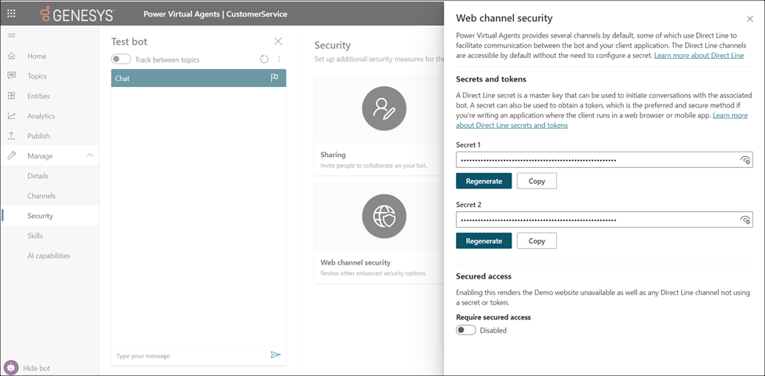
6. Open the `Automate_BYOB2MS.py` file and replace the `MS_BOT_AUTHORIZATION_SECRET` value with `Bearer {<Secret 1>}`. For example:
		`MS_BOT_AUTHORIZATION_SECRET = "Bearer aNieNrIk.YcKFpSi-nPShwuL9Jhji00-xxxc2f2P8xDCSa"`
7. In the Power VA URL, copy the URL part after `/bots/` for later. For example, if the Power VA URL is https://web.powerva.microsoft.com/environments/Default-785ce69c-90cf-4dc7-a882-eaf334d1d25g/bots/b80cde13-489d-4eab-acad-xxxxxfd9rft1/, then copy and save the ID `b80cde13-489d-4eab-acad-xxxxxfd9rft1`. You use this URL part for the bot list.

### Configure AWS services
Complete the following procedures in the AWS console to create the bot interpreter application.

### Set up Amazon DynamoDB

1. Log into the AWS Management Console.
2. Create a table in the Amazon DynamoDB service. Enter `automate-byob2ms-sessions` as the table name. If you change the table name, then be sure to update the parameter `DYNAMODB_SESSIONS_TABLE_NAME` in Line 10 of the `bot_sessions.py` file. Use `botSessionId` as the primary key for the table.

### Create a function using AWS Lambda

1. In the AWS Management Console, select Lambda from AWS services.
2. Click **Create function**.
3. Give a significant name for the function, for example, `MSGCConnector`.
4. Select **Python 3.x** for **Runtime**.
5. Upload both python files from the `\src` directory. To ensure that the code is copied to AWS, click **Deploy**.
6. Add the **AmazonDynamoDBFullAccess** policy to the role that the Lambda function uses. You can also restrict the permissions to the `automate-byob2ms-sessions` table only.

	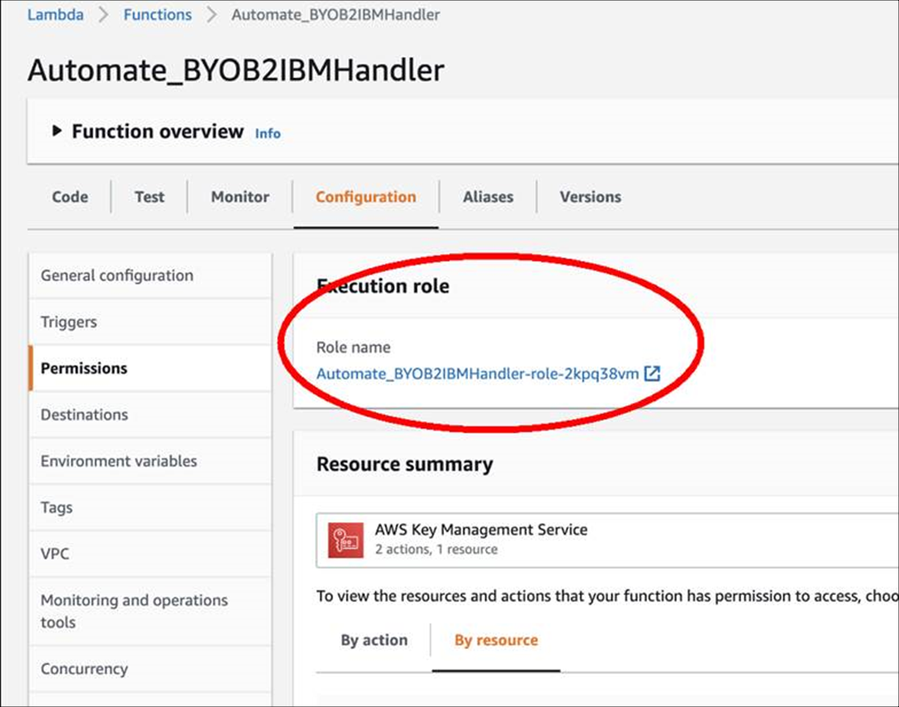

### Add an Amazon API Gateway to the Lambda function

Add an Amazon API gateway to your Lambda function.

1. Select the function that you created in the Lambda console.
2. Under **Functional overview**, click **Add Trigger**.
   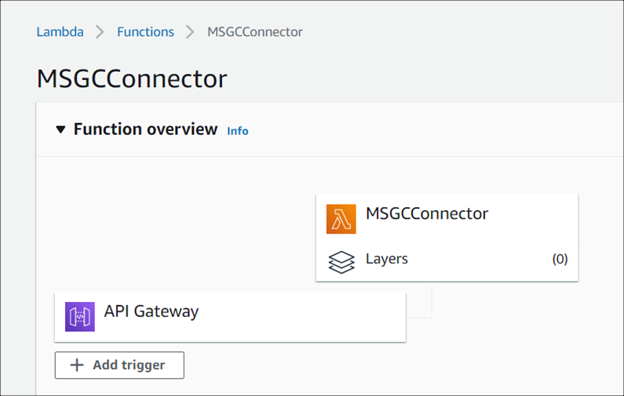
3. Select **API Gateway** and the following options for API:
   * API - Create an API
   * API Type - REST API
   * Security - Open (for testing)
4. Click **Add**.
5. To edit the newly added API Gateway, select the API Gateway from the list under **Functional overview**.
6. Select the root (/) of the **Resources** and choose **Actions** > **Create Resource**.
   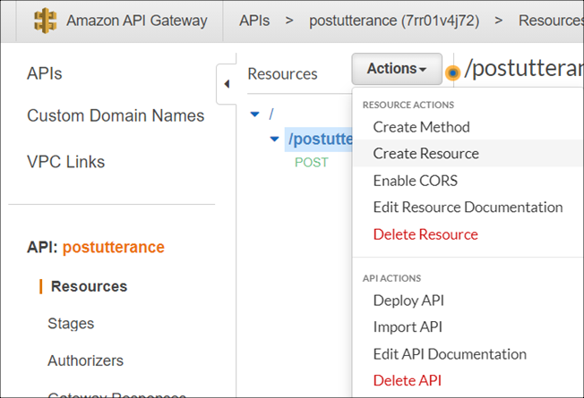
7. Name the resource as `postutterance` and click **Create Resource**.
   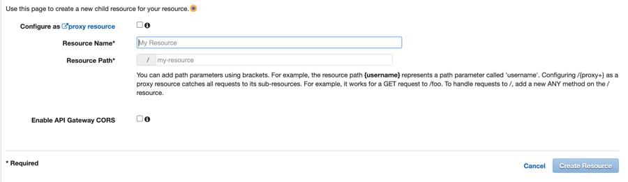
8. Choose **Actions** > **Create Method**. Select **POST** from the list and click the check mark to confirm.
   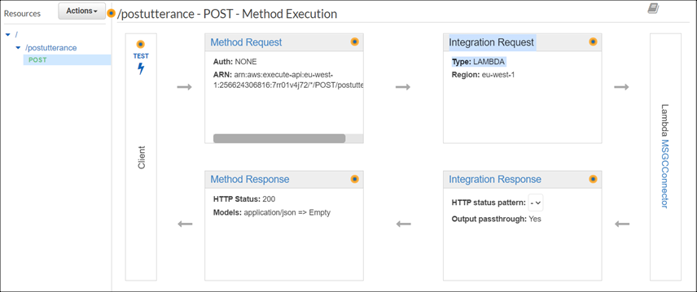
9.  Select **Lambda Function** as the Integration type, enter the function name, and click **Save**.
	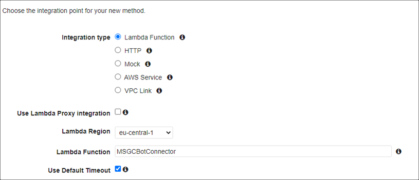

10. Click **Ok**.

11. Select **Integration Request** and expand **Mapping Templates**.
        
12. Click **Add mapping template** and enter `application/json` as the MIME-type for the **Content-Type**. Click the create icon next to the box.
    
	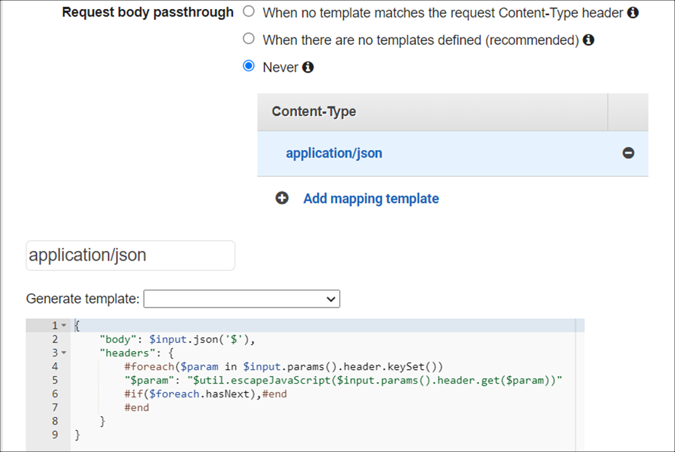

13. Select **Never** for **Request body passthrough** option.
    
14. Scroll down and enter the following JSON request into the code box and click **Save**:
	```JSON	
	{
		"body": $input.json('$'),
		"headers": {
			#foreach($param in $input.params().header.keySet())
			"$param": "$util.escapeJavaScript($input.params().header.get($param))"
			#if($foreach.hasNext),#end
			#end
		}
	}
	```
15. For the POST method, choose **Actions** > **Deploy API**.
    
	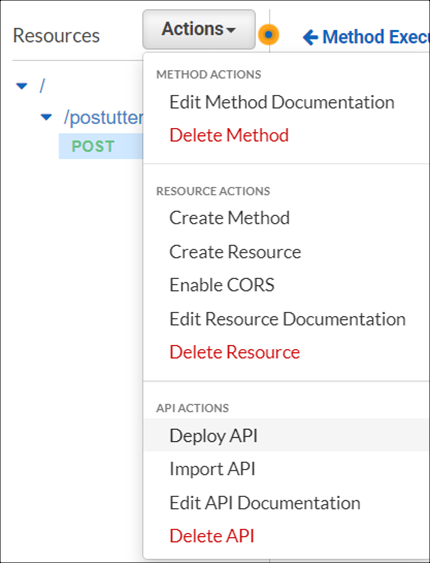

16. Go back to the Lambda function. Under the **Configuration** tab, select **Triggers**. Expand the **Details** section and make a note of the API endpoint URL for later use.
    
	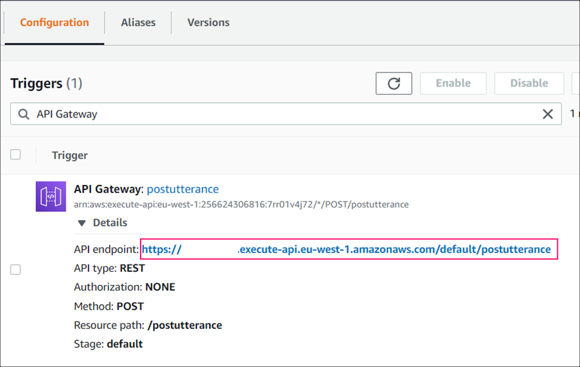


### Configure Genesys Cloud
Complete the following procedures in the Genesys Cloud to listen to the bot and interact with the bot interpreter application.

### Create Genesys Bot Connector integration

1. Click **Admin**.
2. Under **Integrations**, click **Integrations**.
3. Search for Genesys Bot Connector and click **Install**.
4. Provide a name for the integration and click the **Configuration** tab.
5. Click **Properties**.
6. Enter the endpoint URL that you saved from the Amazon API Gateway in the **[Bot Connector Handle Utterance URI](#create-a-power-va-bot "Opens the Create a Power VA bot section")** property.
For example, `https://accountname.execute.api.eu.west-1.amazonaws.com/default/postutterance`
	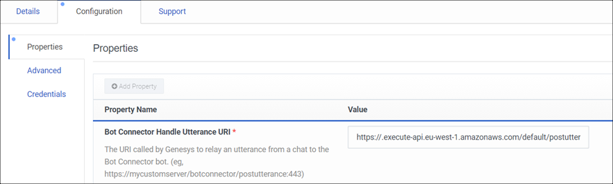

7. Click the **Credentials** tab and add access credentials for the third-party bot. To connect to the Power VA bot that you created earlier, use the [Bearer value](#create-a-power-va-bot "Opens the Create a Power VA bot section") that you noted. You can also use any authorization headers that you want to send.
8. Click **Configure** and the Configure Credentials dialog appears.
   1. Click **Add Credential Field**.
   2. Enter the appropriate access token for the bot.
      * Field Name  - Authorization
      * Value - "Bearer *your secret value*"
  	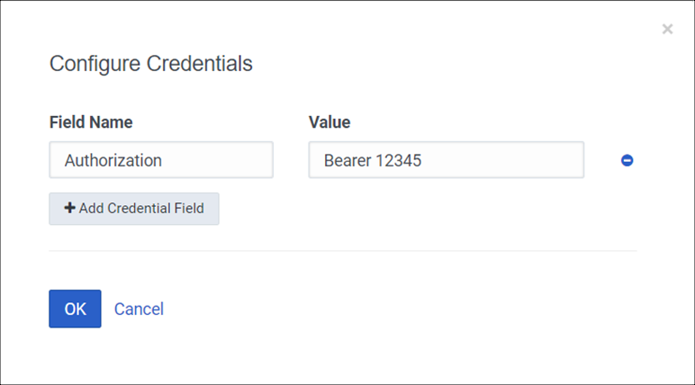
   3. Click **Ok**.

9.  To activate the integration, click the **Status** toggle to change it from **Inactive** to **Active**. Click **Yes**.
10. Make a note of the integration ID from the URL for later use.

### Create a custom role in Genesys Cloud

Create a custom role in Genesys Cloud and assign the **textbots > All Permissions** permission. Assign this role to your Genesys Cloud account.

For more information about roles and permissions, see [Roles and permissions overview](https://help.mypurecloud.com/articles/about-roles-permissions/ "Opens the Roles and permissions page") and [Assign roles, divisions, licenses, and add-ons
](https://help.mypurecloud.com/articles/assign-roles-divisions-licenses-and-add-ons/ "Opens the Assign roles, divisions, and add-ons page") in the Genesys Cloud Resource Center.

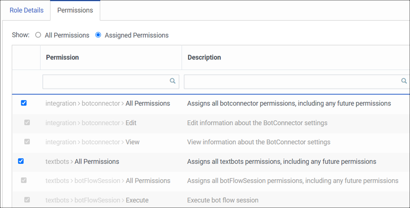

### Load the Power VA bot to the Genesys Cloud bot list

Use any REST API client, such as Postman, to send the HTTP PUT request to Genesys Cloud.

1. Send the PUT request to the Genesys Cloud API `https://api.mypurecloud.ie/api/v2/integrations/botconnector/<your Genesys bot connector integration ID>/bots` with the essential details included in the request:
   * Microsoft Power VA bot ID - The bot ID that you noted when you created the [Power VA bot](#create-a-power-va-bot "Opens the Create a Power VA bot section").
   * Access token from Genesys Cloud to authenticate against the API.

	Ensure that the topics and entities are correct in the payload.


	```
	PUT https://api.mypurecloud.ie/api/v2/integrations/botconnector/{YOUR GENESYS BOT CONNECTOR INTEGRATION ID}/bots
	Authorization: bearer {YOUR GC ACCESS TOKEN}
	Content-Type: application/json

	{
	"chatBots": [
		{
		"id": "{PVA BOT ID}",
		"name": "{DISPLAY NAME}",
		"versions": [
			{
			"version": "Delta",
			"supportedLanguages": [
				"en-us",
				"es"
			],
			"intents": [
				{
				"name": "Check Stock",
				"slots": {
					"Slot1 ": {
					"name": "Slot1",
					"type": "String"
					}
				}
				},
				{
				"name": "Escalate",
				"slots": {
					"Slot2": {
					"name": "Slot2",
					"type": "String"
					}
				}
				}
			]
			}
		]
		}
	]
	}
	```
2. The HTTP `204 No Content` status response code indicates that the request was successful.

The bot is added to the bot list and Genesys Cloud Architect uses this list to populate the bot details.

### Create an Architect flow

1. In Genesys Cloud, navigate to **Admin** > **Architect**.
2. In Architect, create an Inbound Message flow. For more information, see [Add an inbound message flow](https://help.mypurecloud.com/articles/add-inbound-message-flow/ "Opens the Add an inbound message flow article") in the Genesys Cloud Resource Center.
3. Navigate to **Toolbox** > **Bot** and drag a **Call Bot Connector** action to the editor.

	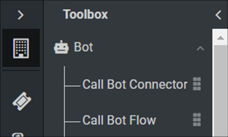
4. Configure the action for the **Name**, **Bot Integration**, and **Bot Version** as specified in the REST API call.

	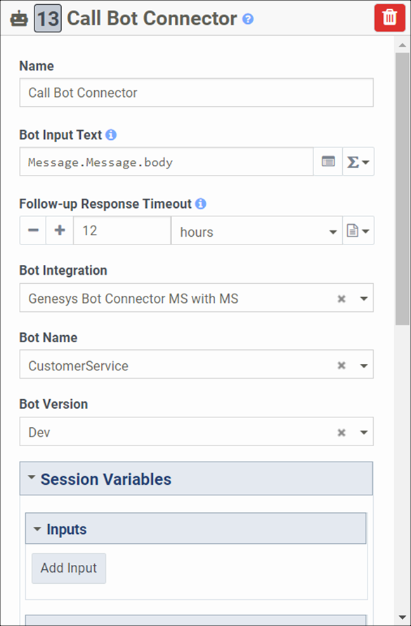
5. Complete the rest of the flow as required. For more information, see [Call Bot Connector action](https://help.mypurecloud.com/articles/call-bot-connector-action/ "Opens the Call Bot Connector action article") in the Genesys Cloud Resource Center.

	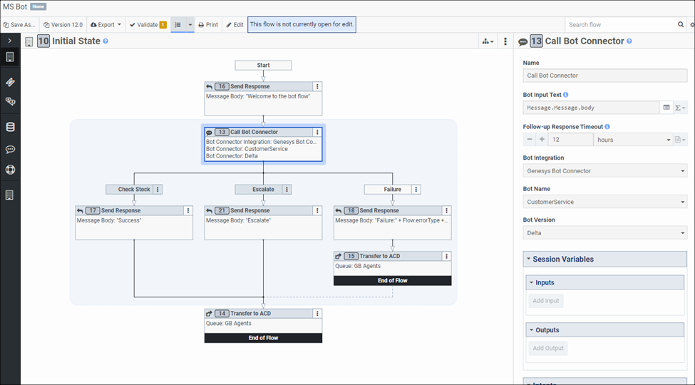

### Set up Web Messaging and test the bot

1. Configure a Messenger to interact with the bot. For more information, see [Configure Messenger](https://help.mypurecloud.com/articles/configure-messenger/ "Opens the Configure Messenger article") in the Genesys Cloud Resource Center.
2. Create a Messenger Deployment with the Architect flow created for the bot. For more information, see [Deploy Messenger](https://help.mypurecloud.com/articles/deploy-messenger/ "Opens the Deploy Messenger article") in the Genesys Cloud Resource Center.
   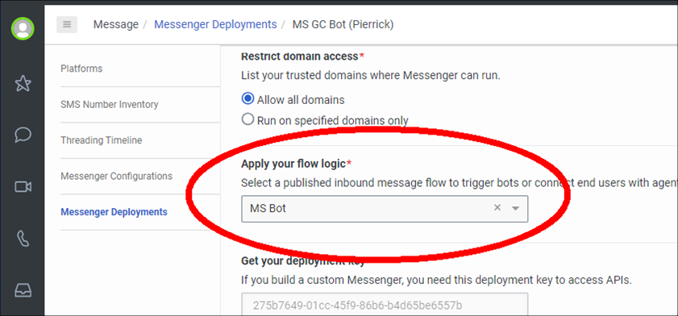
3. To deploy the Messenger to your website, copy the snippet under **Deploy your snippet** and paste the snippet to the `<head>` tag of all of your webpages.

	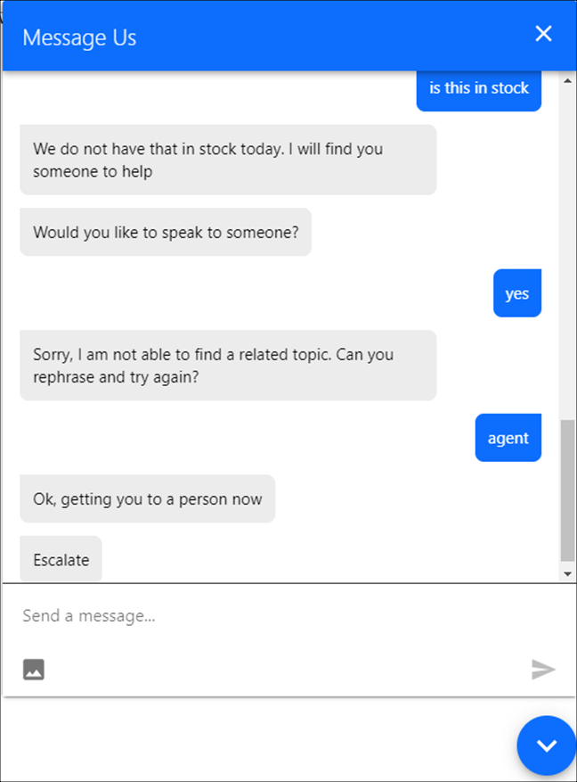
	

## Additional resources

* [About Genesys Bot Connector](https://help.mypurecloud.com/articles/about-genesys-bot-connector/ "Opens the About Genesys Bot Connector page") in Genesys Cloud Resource Center
* [About Web Messaging](https://help.mypurecloud.com/articles/about-web-messaging/ "Opens the About Web Messaging page") in the Genesys Cloud Resource Center
* [AWS Lambda](https://aws.amazon.com/translate/ "Opens the AWS Lambda page") in the Amazon featured services
* [Microsoft Power Virtual Agents Overview](https://docs.microsoft.com/en-us/power-virtual-agents/fundamentals-what-is-power-virtual-agents "Opens the Microsoft Power Virtual Agents documentation") in the Microsoft Power VA documentation
* [Web Messaging](https://help.mypurecloud.com/articles/web-messaging-overview/ "Opens the Web Messaging overview page") in the Genesys Cloud Resource Center