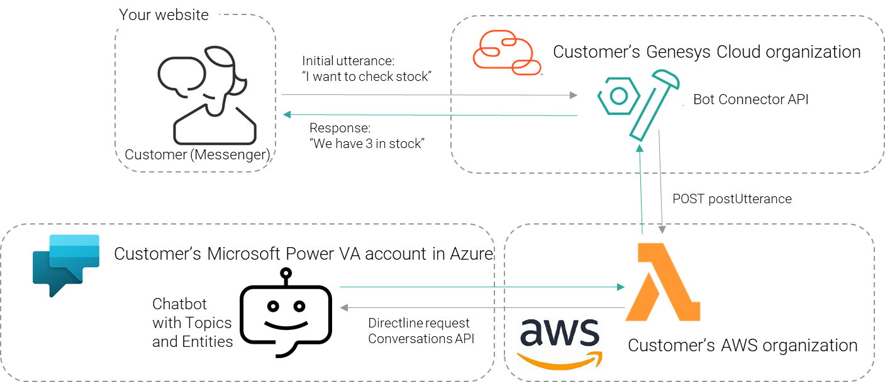

---

title: Use Web Messaging with Genesys Bot Connector and Microsoft Power VA (Virtual Assistant)
author: Marc Sassoon and Pierrick Lozach
indextype: blueprint
icon: blueprint
image: 
category: 3
summary: |
  This blueprint will help you use the Genesys Bot Connector to connect to a Microsoft Power Virtual Agent to answer customer queries via Web Messaging. It also provides a guide to do this for any other bot technology that Genesys does not support as a strategic vendor.
---

This Genesys Cloud Developer Blueprint provides instructions for deploying a Microsoft Power VA bot in Genesys Cloud. The Genesys Bot Connector is used here to provide an API for the bot to connect to, but a direct link between Genesys Cloud and the bot is not possible. For this scenario to work, an application (known as the Bot Interpreter and represented by the Lambda function in the diagram) needs to be in between Genesys Cloud and Power VA. This application takes the message from the customer using Messenger (known as the utterance) from Genesys Bot Connector and changes the format before sending out a HTTP request to Power VA for NLU. The return message is also converted by the Bot Interpreter to match the postUtterance API provided by Genesys Bot Connector.

* [Solution components](#solution_components "Goes to the Solutions components section")
* [Prerequisites](#prerequisites "Goes to the Prerequisites section")
* [Implementation steps](#implementation_steps "Goes to the Implementation steps section")
* [Additional resources](#additional_resources "Goes to the Additional resources section")

## Solution components

[comment]: # List components in logical order (for example, alphabetical, order of use in the solution, Genesys vs. third-party components, large components followed by smaller ones) Copy description from library, if description exists. Otherwise, follow format and brevity of descriptions in library. Format and examples follow. &&: we need to put library in public space.

* **Genesys Cloud Bot Connector** - A set of RESTful APIs that allows you to connect to any bot platform to send and receive utterances. Available in beta and for digital messaging channels only. Please contact your Genesys Account or Partner Manager to enable this feature
* **Microsoft Azure account** - To be able to create the Power VA bot
* **AWS account** - To host the Lambda function that is acting as the Bot Interpreter application that is written in Python.
* **REST client** - Something to submit a HTTP PUT with JSON payload to the Bot Connector API to create the botList. Postman, YARC or any application will work.
* **A website to deploy Web Messaging** - To be able to test the final result.

## Prerequisites

### Specialized knowledge

[comment]: # List specialized knowledge. Copy appropriate items from library, if description exists. Otherwise, follow format and brevity of descriptions in library. Examples follow. &&: we need to put library in public space.

* Administrator-level knowledge of Genesys Cloud.
* Experience with using the Genesys Cloud API.
* Experience with Power VA from Microsoft.
* Ability to create Architect flows.
* Ability to add scripts to HTML pages.

### {Type of} account

[comment]: # Add separate H3 sections for each account, for example, Genesys Cloud account, Vonage account, Salesforce account. Example text follows.

* A Genesys Cloud license. For more information, see [Genesys Cloud pricing](https://www.genesys.com/pricing "Opens the Genesys Cloud pricing page") on the Genesys website.
* (Recommended) The Master Admin role in Genesys Cloud. For more information, see [Roles and permissions overview](https://help.mypurecloud.com/?p=24360 "Opens the Roles and permissions overview article") in the Genesys Cloud Resource Center.
* AWS account with billing to create Lambda functions and API Gateways
* Azure account with billing to be able to create the Power VA agent

## Implementation steps

[comment]: # Add mini-TOC of links to H3 sections. These sections are the implementation steps for the solution. Step name format: imperative verb + noun in sentence case, for example, Download the repository containing the project files. Format and examples follow.

* [Download the repository containing the project files](#download_the_repository_containing_the_project_files "Goes to the Download the repository containing the project files section")
* [Create a Power VA bot](#create_a_power_va_bot "Goes to the Create a Power VA bot section")
* [Configure AWS](#configure_aws "Goes to the Configure AWS section")
* [Configure Genesys Cloud](#configure_genesys_cloud "Goes to the Configure Genesys Cloud section")
* [Declare the Power VA bot to Genesys Cloud](#declare_bot "Goes to the Declare bot to Genesys Cloud section")
* [Create an Architect Flow](#create_architect_flow "Goes to the Create an Architect Flow section")
* [Set up Web Messaging](#setup_messenger "Got to the Set up Web Messaging section")

[comment]: # The following three sections are example implementation step sections. All are H3. Section title format: imperative verb + noun in sentence case.

### Download the repository containing the project files

1. Go to the [GCBotConnectorPowerVa repository](https://github.com/msassoon/GCBotConnectorPowerVa "Opens the GCBotConnectorPowerVa GitHub repository") in GitHub and clone it to your machine.

### Create a Power VA bot

1. Go to https://web.powerva.microsoft.com/
2. Create at least one Topic (Intent) that you want to use later
3. Publish your bot at least once
4. Get Token (Secret 1) from PowerVA web site (Click Manage/Security/Web Channel Security and copy "Secret 1"

	
5. Open the Automate_BYOB2MS.py file and replace the MS_BOT_AUTHORIZATION_SECRET value with “Bearer {YOUR SECRET 1}” e.g. MS_BOT_AUTHORIZATION_SECRET = "Bearer aNieNrIk.YcKFpSi-nPShwuL9Jhji00-218c2f2P8xDBSa"
6. In the Power VA URL, take the part after bots and keep this for later. For example https://web.powerva.microsoft.com/environments/Default-785ce69c-90cf-4dc7-a882-eaf334d1d25g/bots/b80cde13-489d-4eab-acad-26893fd9rft1/ url, the id you need is b80cde13-489d-4eab-acad-26893fd9rft1. We will need this for the botList

### Configure AWS

1. Create a new DynamoDB table (name is "automate-byob2ms-sessions" by default unless you change it in bot_sessions.py line 10 DYNAMODB_SESSIONS_TABLE_NAME)
	1. Use botSessionId as the Primary Key
2. Create a new Lambda function (give it a meaningful name like “MSGCConnector”)
	1. Select Runtime as Python
	2. Add both .py files from the “src” directory. Click on Deploy to ensure the code is copied to AWS.
	3. Add the AmazonDynamoDBFullAccess policy to the role used by the lambda function (you can also restrict permissions to the “automate-byob2ms-sessions” table only)

	
3. Add an API gateway to your lambda
	1.Click the +Add Trigger button

	
	
	2. Select API Gateway, then Create and API from the list. Choose REST API and choose a security method (Open is fine for testing). Click Add.
	3. Once created, select the API Gateway from the list to edit it.
	4. Select the root of the Resources and click on the Actions button. Select Create Resource and call it postutterance. Click Create Resource.
	
	
	
	5. Now, from Actions, Select Create Method. From the drop down that appears, select POST. Click on the new POST option
	
	
	6. Click on Integration Request
	7. Select Lambda Function
	
	
	8. Scroll down to Mapping Templates. Click Add mapping template. Enter application/json. Click the tick and scroll down to see a new box
	
	
	9. Paste this code into the code box as shown above
	
{
    "body": $input.json('$'),
    "headers": {
        #foreach($param in $input.params().header.keySet())
        "$param": "$util.escapeJavaScript($input.params().header.get($param))"
        #if($foreach.hasNext),#end
        #end
    }
}

	10. Request Body Passthrough should be set to "Never"
	11. Click Save.
	12. Click the Actions button again and select Deploy API

	
	13. You can now close the tab and go back to the Lambda function.
	14. Under Configuration, open the Triggers and the API Gateway. Click on Details and record the API Endpoint url for later
	
	

###Configure Genesys Cloud

1.Create a new “Genesys Bot Connector” integration
	1. Go to Admin and select Integrations.
	2. Click on the +Integrations button to add a new one. Search for Genesys Bot Connector and click Install
	3. Name the integration and click on Configuration
	4. In the field Bot Connector Handle Utterance URI paste in the API endpoint url saved from the AWS API Gateway config e.g. https://accountname.execute.api.eu.west-1.amazonaws.com/default/postutterance
	
	
	5. Under the Credentials tab, we must add something. You can use the bearer we created earlier, or any authorization headers you want to send.
	6. Click Configure. Click Add Credential Field. You can enter Authorization for the Field Name and “Bearer {YOUR SECRET 1}” for the Value. The sample does not use this, but for other integrations it can help

	
	7. Save and activate the integration
	8. Get the ID for the integration from the URL as we will need this later.
2. Create a role (or edit an existing one) and add the permissions to it:
	1. Integration -> botconnector -> All Permissions
	2. Textbots -> All Permissions
	
	
	3. Assign this role to your account in Genesys Cloud.
	
###Declare the Power VA bot to Genesys Cloud

1. Get the PVA bot id from the Microsoft PowerVA (after “Default”) URL: https://web.powerva.microsoft.com/environments/Default-xxxxxxxx-xxxx-xxxx-xxxx-xxxxxxxxxxxx/bots/{id}/ as mentioned earlier.
2. Get your access token from Genesys Cloud to authenticate against the API.
3. Call the following Genesys Cloud API (check if topics and entities are correct first):

PUT https://api.mypurecloud.ie/api/v2/integrations/botconnector/{YOUR GENESYS BOT CONNECTOR INTEGRATION ID}/bots
Authorization: bearer {YOUR GC ACCESS TOKEN}
Content-Type: application/json

{
  "chatBots": [
    {
      "id": "{PVA BOT ID}",
      "name": "{DISPLAY NAME}",
      "versions": [
        {
          "version": "Delta",
          "supportedLanguages": [
            "en-us",
            "es"
          ],
          "intents": [
            {
              "name": "Check Stock",
              "slots": {
                "Slot1 ": {
                  "name": "Slot1",
                  "type": "String"
                }
              }
            },
            {
              "name": "Escalate",
              "slots": {
                "Slot2": {
                  "name": "Slot2",
                  "type": "String"
                }
              }
            }
          ]
        }
      ]
    }
  ]
}

4. You should receive a 204 No Content if all works well
5. This declares your bot config to Genesys Cloud so it can be found in Architect.

###Create an Architect Flow

1. In Architect, create a new Inbound Message flow (no other type is supported).
2. From the Tools, drag on a Call Bot Connector block from the Bot menu

	
3. In the options of the Call Bot Connector block, you should now be able to select your Bot Integration, Bot Name and Bot Version as specified in the API call we made earlier

	
4. Create the rest of the flow as you would for other bots

	

###Set up Web Messaging

1. Create a configuration in any way you like
2. Create a deployment
	1.Send messages to your message flow
	
	
	2. Copy the snippet from the Deployment and deploy to a web page to test. The index.html page in the code has a sample to use.

	
	

## Additional resources

[comment]: # Do not list any links mentioned in the blueprint. List any links to Genesys or third-party material that provide further background. Format and examples follow.

* [About Genesys Bot Connector](https://help.mypurecloud.com/articles/about-genesys-bot-connector/ "Opens the About Genesys Bot Connector document")
* [About Web Messaging](https://help.mypurecloud.com/articles/about-web-messaging/ "Opens the About Web Messaging document")